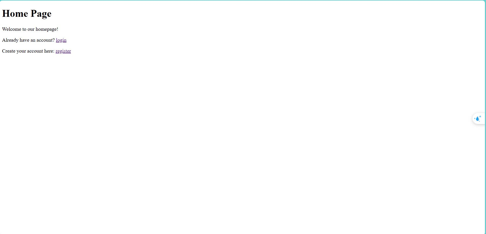
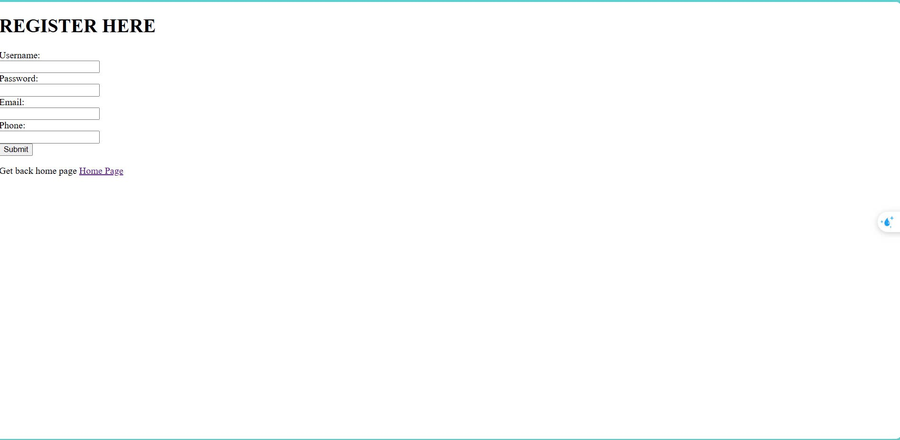
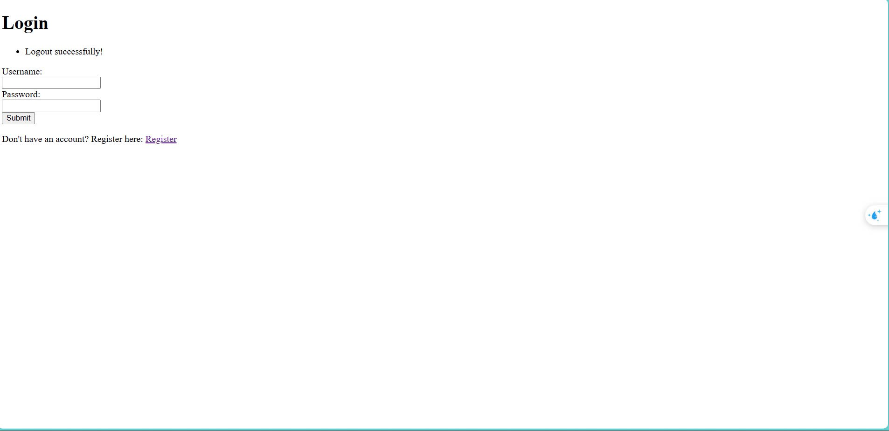
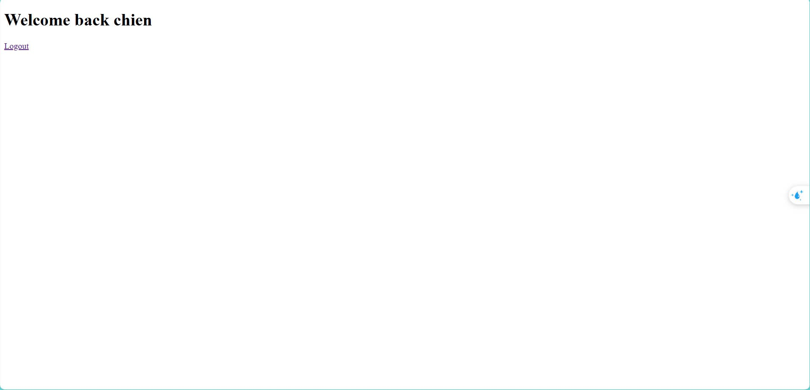
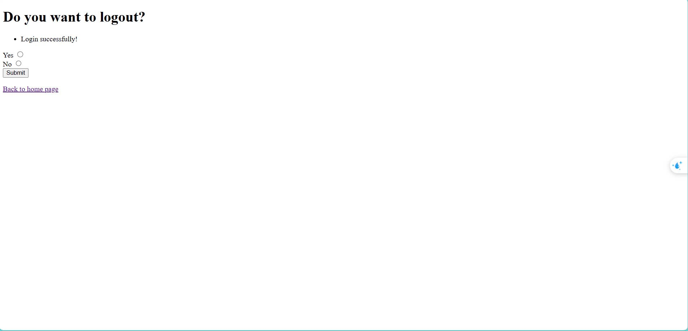

Version 2 thêm các chức đăng nhập/ đăng ký
- Tạo file urls.py dùng để tạo địa chỉ cho từng trang
- tạo thư mục templates/account chứa các file html
- Cấu hình người dùng trong file models.py

*Lưu ý: 
- Vì kế lớp UserBlog được kế thừa từ lớp User của django nên ta cần thêm dòng sau vào file blog_web/settings.py: "AUTH_USER_MODEL = 'accountApp.UserBlog'"
- khai báo app account để cho django biết trong phần INSTALLED_APPS của blog_web/settings.py

Các trang web đăng nhập/ đăng ký:
- Trang chính: 
- Trang đăng ký: 
- Trang đăng nhập: 
- Trang Home (nơi sẽ chứa các bài blog của user): 
- Trang logout: 