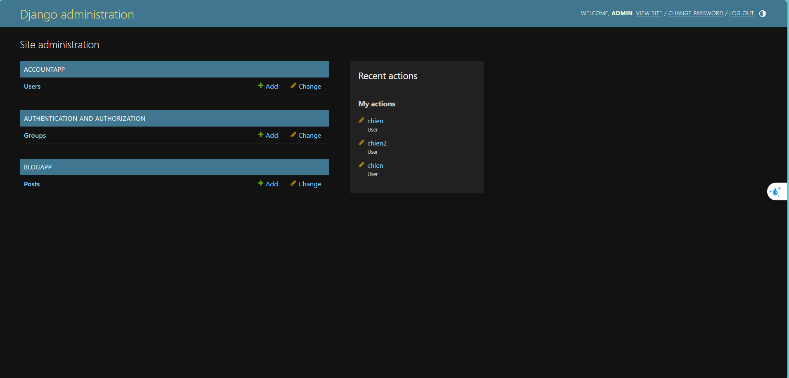
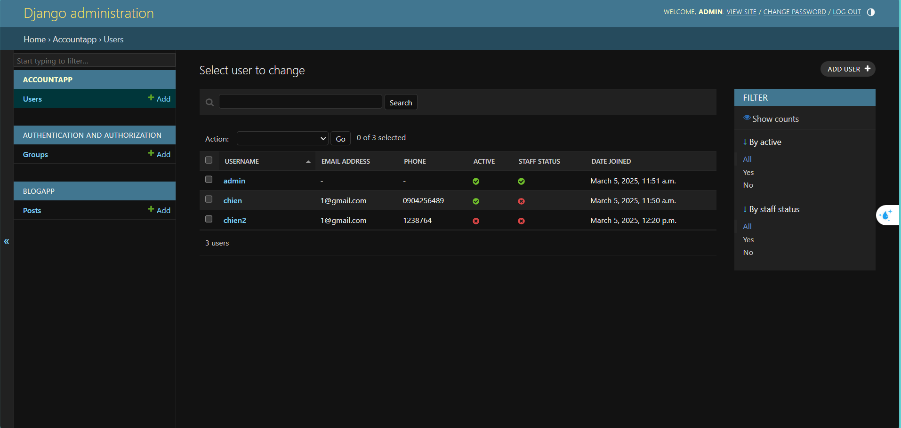
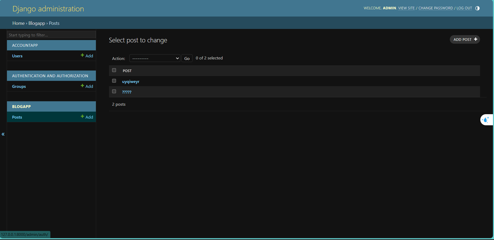
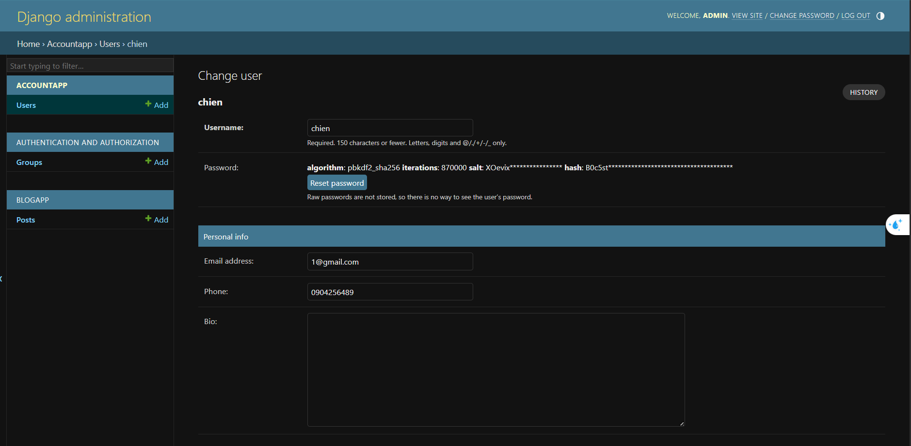
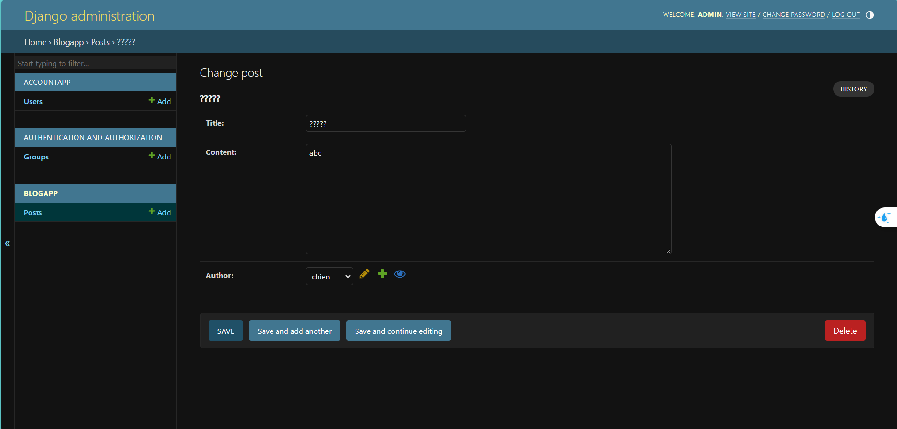

Thêm user admin để quản lý user và quản lý các bài post. Admin này chỉ là 1 người và có thể quản lý cả user và các bài post.
- Admin có thể khóa user (block) và reset mật khẩu cho user.
- Admin quản lý tất cả các bài post của user, có thể xóa, chỉnh sửa một bài post bất kì.

Trước khi khai báo admin, cần phải tạo người dùng admin bằng dòng lệnh: py manage.py createsuperuser

Truy cập vào địa chỉ "/admin" để vào trang admin
- Trang chính admin: 
- Quản lý users: 
- Quản lý posts: 
- Chỉnh sửa thông tin user: 
- Chỉnh sửa thông tin post: 